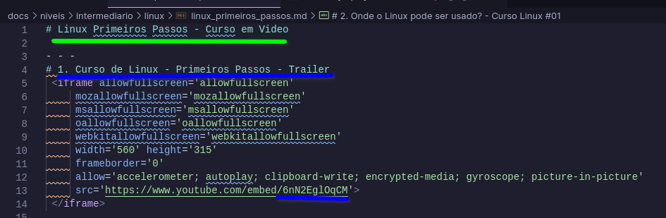
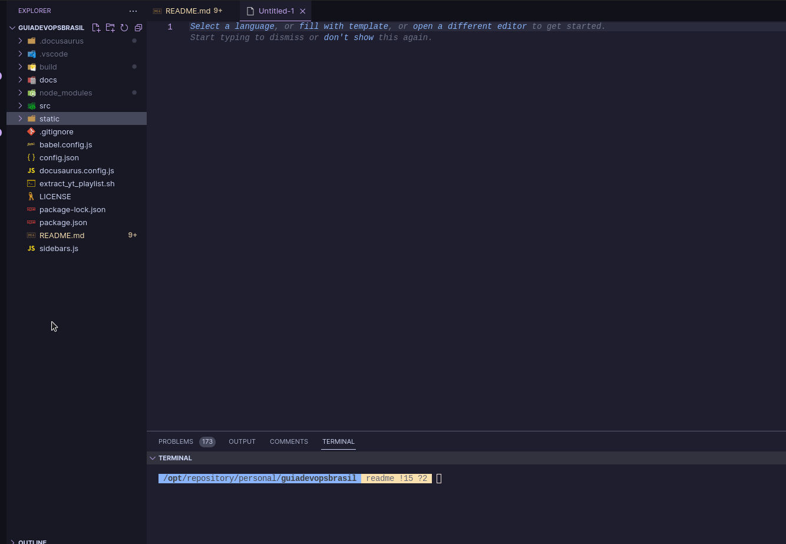
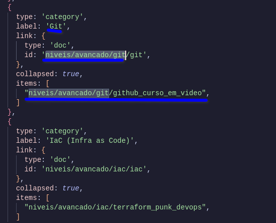

<h1 align="center"> Guia DevOps Brasil </h1>

<p align="center">
<br>


</p>

<p align="center">
<strong>Contato</strong><br>
<a href="https://github.com/waltenne"> </a>    
<a href="https://www.linkedin.com/in/waltenne/"></a>    
<a href="https://twitter.com/waltenne"></a>
<p>

Seja bem vindo ao projeto **Guia DevOps Brasil**, é um projeto Open Source que nasceu em **Março de 2022**.

Com a ideia de ser um facilitador para organização de conteúdos gratuitos e em português sobre DevOps feitos pela comunidade, na maioria das vezes playlists do youtube.

Foi pensado tanto como nas pessoas que querem entrar na carreira DevOps e não sabem por onde começar, mas também para as pessoas que já estão na área para aprimorar os conhecimentos, ajudando outras pessoas.

Encontrou um Bug 🐛, tem uma ideia 💡? É só abrir uma [issue](https://github.com/waltenne/guiadevopsbrasil/issues).
Quer contribuir? Envie uma [PR](https://github.com/waltenne/guiadevopsbrasil/pulls), com a sua melhoria.

**Caso não saiba como contribuir leia a documentação abaixo ou assista esse vídeo.**

1. [COMO CONTRIBUIR COM OPEN SOURCE NO GITHUB - DANIEL BONIFACIO](https://www.youtube.com/watch?v=n0lSrPl9DTc)
 
## Indice

- [Indice](#indice)
- [Como Contribuir?](#como-contribuir)
  - [Fork](#fork)
  - [Faça o Clone](#faça-o-clone)
  - [Instale as dependencias](#instale-as-dependencias)
  - [Buildando o Projeto](#buildando-o-projeto)
  - [Iniciando o Projeto](#iniciando-o-projeto)
- [Como incluir novos conteúdos?](#como-incluir-novos-conteúdos)
  - [Adicionando conteúdo](#adicionando-conteúdo)
- [Quem já contribuiu?](#quem-já-contribuiu)
- [Contribuição](#contribuição)


## Como Contribuir?

Para executar o projeto localmente você precisa preparar o seu ambiente relizando a instalação do [Node.js](https://nodejs.org/en/download/) versão **16.14** ou superior.
 
   * Você poderá utilizar o [nvm](https://learn.microsoft.com/pt-br/windows/dev-environment/javascript/nodejs-on-windows) para o gerenciamento das versões do Node.
     * Ao instalar o Node.js, é recomendável que você marque todas as caixas de seleção relacionadas às dependências.
  * Precisa do Git instalado e configurado para sua conta do Github,
    * [Windows](https://www.youtube.com/watch?v=mmcOw2ynWEs)
    * [Linux](https://www.youtube.com/watch?v=CSyEYiG8sFI)

Como a integração utiliza o Docussaurus, caso tenha interesse em conhecer e com conhecimentos em front [documentação](https://docusaurus.io/docs), você pode sugerir melhorias para o projeto.

### Fork

Primeiramenta faça um [Fork ou Bifurcação](https://docs.github.com/pt/get-started/quickstart/contributing-to-projects), do repositório, que funcionará como um cópia do repositório para sua conta.

Clique no **Fork**


Siga as etapas para fazer a cópia do repositório em sua conta.

### Faça o Clone

Após o fork ser feito, o repositório irá aparecer na sua conta, abra o repositório e clique no botão Code


Irá aparecer três opções para clonar, selecione a que deseja e copie o comando

Por exemplo
```
git clone https://github.com/NOME_SEU_USUARIO/guiadevopsbrasil.git
```

Onde o **NOME_SEU_USUARIO** é seu usuário do github.


Após concluido acesse o diretório a abra o repositório com o seu editor favorito, nesse caso estou usando o vscode
```
cd guiadevopsbrasil
code .
```

Faça o checkout para uma nova branch para você trabalhar na edição que precisa,você pode seguir os [Padrões e nomeclaturas do git](https://www.brunodulcetti.com/padroes-e-nomenclaturas-no-git/)
```
git checkout -b nome_da_branck
```

### Instale as dependencias
 
Com o terminal aberto na pasta do projeto digite

```
yarn install
```

ou

```
npm install
```
 
Pronto! Os módulos necessários para buildar e rodar os projeto estão instalados.
 
### Buildando o Projeto

```
npm run build
```

### Iniciando o Projeto

Para iniciar o projeto digite o seguinte comando

```
npm run serve
```

Após isso, acesse via navegador no endereço **http://localhost:3000**

## Como incluir novos conteúdos?

Se você olhar os arquivos dos conteúdos estão no diretório **docs/**, a partir disso organizado de acordo com a sua categoria, todos os arquivos em formato markdown clique [aqui](https://www.markdownguide.org/) para ver uma documentação de referência para edição nessa linguagem, mas você pode se basear os arquivos markdown já existentes.

### Adicionando conteúdo

Decidi embedar / incorporar o player do youtube no markdown.

Acredito que dessa forma quem for acessar terá uma experiência melhor em vez de simplesmente sir lincando os links dos videos, para fazer isso utilizo o código iframe, o próprio código que o youtube disponibilzia ao clicar em incorporar.

**Como no exemplo a seguir**



**1.** O que está em verde é o Título dessa página
**2.** O que está em azul são os valores que precisam ser alterados para cada vídeos diferente, seja o título do video com a numeração da quantidade por exemplo video 1. video 25. etc etc e no final o id do video no youtube.

Para tentar facilitar o entendimento mais baixo nível, agora vou descrever passo a passo.

Por exemplo temos a seguinte playlist do youtube do Curso em Video

```
https://www.youtube.com/watch?v=xEKo29OWILE&list=PLHz_AreHm4dm7ZULPAmadvNhH6vk9oNZA
```

A url é montada da seguinte forma

**URL BASE**
```
https://www.youtube.com/watch
```

**ID do video atual** = xEKo29OWILE
```
?v=xEKo29OWILE
```
**ID da playlist** = PLHz_AreHm4dm7ZULPAmadvNhH6vk9oNZA
```
&list=PLHz_AreHm4dm7ZULPAmadvNhH6vk9oNZA
```

Com base no print acima, precisamos apenas de duas informações o ID do video para montar substituir os itens do código e o titulo do vídeo, se uma playlist for muito grande pode dar um pouco de trabalho para fazer isso na mão por isso eu deixo uma ferramenta para auxiliar o **extract_yt_playlist.sh**, ele via montar o markdown 99% pronto para você, bastando informar qual é o ID da playlist, seguindo o exemplo a seguir vou demonstrar como funciona.

No terminal basta chamar dessa forma

```bash
./extract_yt_playlist.sh ID_PLAYLIST_YOUTUBE
```
Substituindo o **ID_PLAYLIST_YOUTUBE** pelo ID correto da playlist, ao executar o script **apenas para linux**, irá gerar um arquivo markdown 99% pronto com o que você precisa **playlist_converted.md**





Assim que for gerado renomeie o **playlist_converted.md** para o nome da página que você ache mais interessante, por exemplo.

```bash
mv playlist_converted.md curso_git_curso_em_video.md
```

Abra o arquivo renomeado e na primeira linha digite um título, por exemplo

```markdown
# Curso Git e Github - Curso em Video

- - -
# 1. O que é Git? O que é versionamento? - Curso de Git e GitHub
 <iframe allowfullscreen='allowfullscreen'
	 mozallowfullscreen='mozallowfullscreen'
	 msallowfullscreen='msallowfullscreen'
	 oallowfullscreen='oallowfullscreen'
	 webkitallowfullscreen='webkitallowfullscreen'
	 width='560' height='315'
	 frameborder='0'
	 allow='accelerometer; autoplay; clipboard-write; encrypted-media; gyroscope; picture-in-picture'
	 src='https://www.youtube.com/embed/xEKo29OWILE'>
 </iframe>
```

Mova o arquivo md gerado para o diretório que deverá ficar, por exemplo esse curso ficará no nível avançado então ficando dessa forma, dependendo do assunto se for ter mais de um curso sobre ele por exemplo, git linux e tals, pode ser criado uma subpasta para organização e ir linkando os arquivos, na dúvida sempre pegue de referência o que já está cadastrado.

```bash
mv curso_git_curso_em_video.md docs/niveis/avancado/git/
```
Para finalizar, falta mapear o markdown no menu que irá aparecer, como o assunto de git, já tem um subpasta mapeado, abra o arqwuivo git.md e adicione o mapeamento para esse arquivo md, como por exemplo no item 1 basicamente

```
NUMERO_ORDENADO_DO_ITEM. [Assunto](./arquivo.md)
```

Como do exemplo abaixo

```md
# Git

1. [Github - Curso em Vídeo](./github_curso_em_video.md)
2. [Git 4 Noobs](https://github.com/DanielHe4rt/git4noobs)
3. [Comandos Git](https://github.com/theandersonn/comandos-git)
4. [Aprenda Git](https://learngitbranching.js.org/)
5. [Git School](https://git-school.github.io/visualizing-git/)
6. [Git Flow Cheatsheet](https://danielkummer.github.io/git-flow-cheatsheet/)
```

Feito isso agora precisa ser incluido essa alteração no arquivo **sidebars.js**, basta fazer o mapeamento seguindo os diretórios e categorias, como por exemplo.




**Obs:** Para conteúdos onde não existe uma playlist do youtube, por exemplo um único vídeo que explica sobre um assunto x ou um link de documentação ou até de outro repositório não precisa fazer todo aquele processo acima utiliando o script, basta realizar a edição direta do **arquivo.md** do assunto principal ou criar um novo para esse assunto fazendo os mapeamento necessários.


## Quem já contribuiu?

<p align="center">
  <a href = "https://github.com/waltenne/guiadevopsbrasil/graphs/contributors">
    
  </a>
</p>

## Contribuição

Pull requests são bem-vindos. Para grandes mudanças, por favor, abra primeiro uma issue para discutirmos a mudança.
