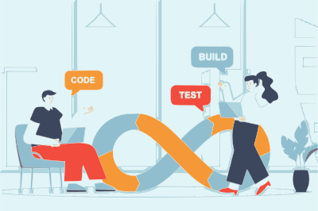
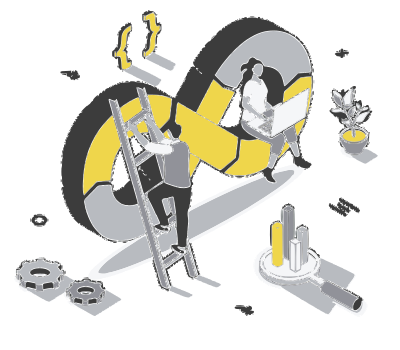
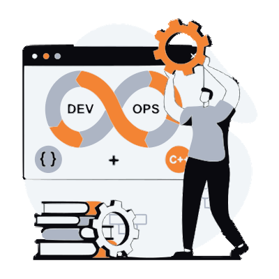

# Introdução

Boas-vindas ao Guia DevOps Brasil.

Esse portal serve para compartilhamento de informações gratuitas do mundo devops.

Através desse portal ser colaborativo, montado de comunidade para comunidade com muito carinho.

- - -

## O que é DevOps ?

<iframe width="700" height="315" src="https://www.youtube.com/embed/5XRXyYF_bqI" frameborder="0" allow="accelerometer; autoplay; encrypted-media; gyroscope; picture-in-picture" allowfullscreen></iframe>

- - -

## Mais Sobre DevOps

1. [Dicionado Devops - Código Fonte TV](https://www.youtube.com/watch?v=iwf6kcvxeD4) 
2. [Entendendo "Devops" para Iniciantes em Programação 1 - Fabio Akita](https://www.youtube.com/watch?v=bwO8EZf0gLI) 
3. [Entendendo "Devops" para Iniciantes em Programação 2 - Fabio Akita](https://www.youtube.com/watch?v=mcwnQVAn0pw) 
4. [Cultura Devops - Punk do DevOps](https://www.youtube.com/watch?v=CZf2pvvbHHw&list=PLFfGe1VU0nwReYgbmy6pQDr7Q4t8dVFyT) 
5. [Conceitos DevOps - Udemy Claudio Antonio da Silva](https://www.udemy.com/course/conceitos-devops/) 
6. [Por onde Começar a Estudar DevOps - Punk do DevOps](https://www.youtube.com/watch?v=_TivgYYAmnk) 
7. [Como ser um DevOps Engineer - LinuxTips](https://www.youtube.com/watch?v=Z_GTtWzoHOA) 
8. [DevOps Engineer ou SRE - LinuxTips](https://www.youtube.com/watch?v=z9XFkKmkDsU) 
9. [DevOps na Vida Real - Jefferson Noronha](https://www.youtube.com/watch?v=KbvfV01tSig) 

- - -

## Pilares DevOps

DevOps surge para como uma estretégia para resolver problema de conflitos na busca rápida para inovação constante e principalmente manter um ambiente seguro e estável.

A cultura DevOps portanto para contribuir com o trabalho em equipe é estruturado em quatro pilares

1. Comunicação
2. Colaboração
3. Automação
4. Monitoração

- - -

### Comunicação

A comunicação de DevOps deve criar meios e processos para garantir as demandas e necessidades das relações das equipe Dev e Operação.

### Colaboração

Colaborar é se comprometer com a possibilidade de produzir um resultado maior do que aquele que seria desenvolvido isoladamente.

### Automação

Criação de processos para que diversas atividades rotineiras que demandam muito tempo, possam ser realizadas automaticamente, muito mais rápido.

### Monitoração

Uso de ferramentas para se obter metricas com isso é possível gerar insights sobre os processos e estabelecer melhorias.

:::tip Dica
Caso você deseha colaborar com esse projeto, acesse o [nosso repositório](https://github.com/waltenne/guiadevopsbrasil) 😉.
Não esqueça de deixar o Star para ajudar
:::
